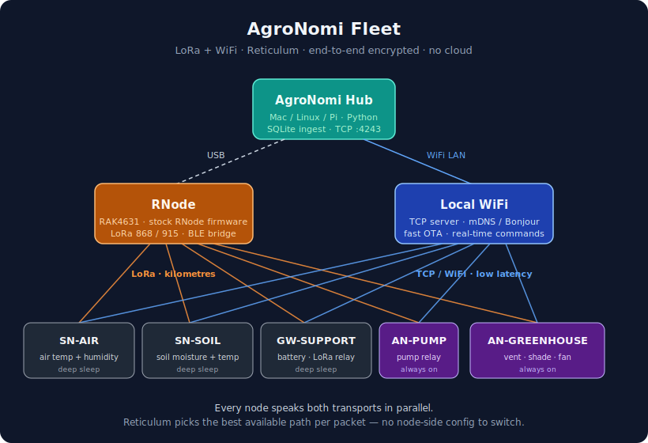
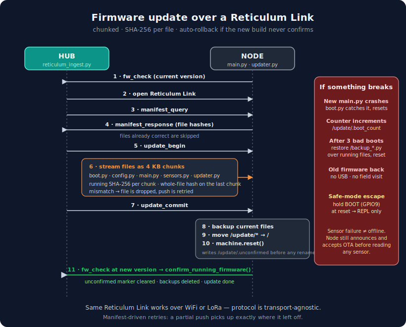

# AgroNomi Fleet

> A self-organising LoRa + WiFi mesh for small-farm telemetry and control.  
> Encrypted by default · No cloud · No subscriptions · Updates over the air.

**AgroNomi Fleet** is what you get when you build a farm sensor network on a real mesh stack instead of LoRaWAN. ESP32 nodes deep-sleep in the field, wake to send readings over LoRa (or WiFi when in range), and a small hub on your desk collects everything into a local database. There's no gateway subscription, no Chirpstack, no Things Network — just your hardware talking directly to your hub.

Crucially, **every firmware change ships over the air via a Reticulum Link** — the same mesh that carries telemetry. You flash a node once on the bench; after that you edit code on your laptop and the node picks the update up on the next wake. If the new build misbehaves, the device rolls itself back to the previous version without any field visit.

## What AgroNomi Fleet enables

- **A single LoRa radio for an entire small farm.** One RAK4631 board plugged into your hub via USB acts as the LoRa front-end for every sensor and actuator. No gateways. No backhaul.
- **Indoor-to-field continuity.** Greenhouse and pump nodes near your WiFi use TCP for fast OTA and low latency. Remote orchard sensors stay on LoRa. The mesh handles the handoff with no node-side configuration.
- **Truly remote management.** With optional Tailscale on the hub, you can fix or rewrite a node from anywhere in the world — no physical access needed after the first flash.
- **Self-healing fleets.** A bad firmware build doesn't brick the node — it rolls back. A broken sensor doesn't take the node offline — it still announces and accepts OTA, so you can ship a fix remotely.



## Why a mesh, not LoRaWAN

LoRaWAN is great if you want to send a few bytes uphill to a public network three times an hour. AgroNomi Fleet exists because that wasn't enough — we wanted real bidirectional traffic, OTA, and a local-only deployment without paying for or running a LoRaWAN gateway.

| | LoRaWAN | AgroNomi Fleet (Reticulum) |
|---|---|---|
| **Gateway** | Dedicated multi-channel gateway (~€200+) | One RAK4631 over USB |
| **Backhaul** | Internet + network server subscription | None — fully local |
| **Encryption** | Application + network layer, you manage keys | End-to-end by default, identity-based |
| **Downlink** | Slow, mostly read-only (Class A) | Bidirectional, latency ~1 RTT |
| **OTA firmware** | LoRaWAN FUOTA is a research topic | Built in over a Reticulum Link, with rollback |
| **Path discovery** | Star topology, one gateway | Multi-hop mesh, automatic relay |
| **Transport mixing** | LoRa only | LoRa + TCP/WiFi simultaneously, best-path routing |
| **Duty-cycle politics** | Regional caps (1 % EU) on every packet | Same physical caps apply — but you choose how to spend them |

If you only need a few short uplinks per day, LoRaWAN is simpler. If you want to deploy, debug, and iterate a real fleet without ever pulling the cable, AgroNomi Fleet is the better foundation.

## Node types

| Node | Measures / controls | Power |
|---|---|---|
| **SN-AIR** | Air temperature, humidity, battery | Deep sleep |
| **SN-SOIL** | Soil moisture, soil temperature, battery | Deep sleep |
| **GW-SUPPORT** | Battery (and acts as a LoRa transport relay) | Deep sleep |
| **AN-PUMP** | Pump relay | Always on |
| **AN-GREENHOUSE** | Vent relay, shade PWM, fan relay | Always on |

The `m_reticulum/esp32c6/` folder is a template — copy it and edit `config.py` to add your own node type.

## The hub and the RNode

The hub host (a Mac, Linux box, or Raspberry Pi) talks to two things:

- **The RNode** — physically a [RAK4631](https://docs.rakwireless.com/Product-Categories/WisBlock/RAK4631/Overview/) board (nRF52840 + SX1262), running the unmodified open-source [RNode firmware](https://github.com/markqvist/RNode_Firmware) by markqvist. Plug it into USB and it's both your LoRa transceiver and your BLE bridge — every ESP32 node BLE-pairs to it once, then talks to the mesh through it for as long as it lives.
- **Your local WiFi** — for any node within range, the hub also accepts a direct TCP connection on port 4243. OTA pushes and command-response traffic ride this when available; LoRa picks up everywhere else.

Both transports run in parallel and Reticulum picks the best path per packet. No node-side configuration is needed to switch between them.

## OTA updates over a Reticulum Link

This is the part people get excited about, so it gets its own diagram.



What happens when you queue an update:

1. **You** queue a push on the hub. No node interaction yet — just a database row.
2. **The node** sends `fw_check` on its next wake (sensor nodes: every few minutes; actuators: at boot and periodically).
3. **The hub** opens a stateful Reticulum Link to the node and asks for a manifest of currently-installed file hashes.
4. **Files stream as 4 KB chunks** (sized to fit the ESP32-C6 contiguous-heap limit). Each file is SHA-256-verified per chunk and again as a whole. Files the node already has correct are skipped.
5. **Commit + reboot.** The node writes a `.reboot_needed` marker, calls `machine.reset()`, and the new firmware applies on next boot.
6. **The device re-registers** with the hub on the new version and calls `confirm_running_firmware()` from `main.py` — that's the explicit "I'm good" signal that disarms the rollback counter.

**Rollback for free.** If the new firmware fails to import, crashes during init, or never reaches steady state, `boot.py` resets the device. After three unconfirmed boots the bootloader restores the previous firmware from `/backup_*.py` files automatically. No USB cable, no field visit.

**Safe-mode escape hatch.** Holding the BOOT button (GPIO9 on the ESP32-C6 Super Mini) at reset drops the device straight to REPL without running `main.py`. Useful if you've ever wedged a device with a bad manual file copy.

**Sensor failure never blocks recovery.** The boot order is: register with hub → send `fw_check` → *then* read sensors (wrapped in try/except). A bad pin or disconnected probe still lets the node join the mesh, so a remote OTA fix is always possible.

## Tested on

| Component | Role |
|---|---|
| **ESP32-C6 Super Mini** | Node MCU running MicroPython 1.22+ |
| **RAK4631** | LoRa radio + BLE bridge — unmodified [RNode firmware](https://github.com/markqvist/RNode_Firmware) |
| **DHT22** | Air temperature + humidity |
| **Capacitive soil-moisture probe** | Soil moisture |
| **DS18B20** | Soil temperature |
| **5 V relay module** | Pump / vent / fan control |
| **Mac running macOS** | Hub host |

Other ESP32 variants and other Reticulum-capable hub hosts (Linux, Raspberry Pi) should work but have not been verified end-to-end yet.

## Install

### 1. Hub

Python ≥ 3.10, an RNode over USB, and a small Reticulum config.

```bash
pip install rns
```

Edit `~/.reticulum/config`:

```ini
[reticulum]
enable_transport = True

[[Default Interface]]
type = TCPServerInterface
listen_ip = 0.0.0.0
listen_port = 4243

[[RNode]]
type = RNodeInterface
port = /dev/tty.usbserial-XXXX     # your RNode USB port
frequency = 868000000              # 868 MHz EU / 915 MHz US
bandwidth = 125000
spreadingfactor = 11
codingrate = 5
txpower = 17
```

`enable_transport = True` lets the hub relay traffic between its interfaces. Start the hub:

```bash
python3 documents/reticulum_ingest.py
```

It listens on TCP 4243 for incoming nodes and discovers anyone announcing on the mesh.

### 2. First-time node flash (USB, one time only)

You only do this once per device — afterwards the node updates itself over the mesh.

```bash
# 1. Erase + flash MicroPython 1.22+
esptool.py --chip esp32c6 erase_flash
esptool.py --chip esp32c6 write_flash -z 0 micropython-esp32c6-1.22.bin

# 2. Upload the µReticulum library (same for every node)
mpremote cp -r m_reticulum/esp32c6/repo/firmware/urns/ :urns/
mpremote cp -r m_reticulum/esp32c6/repo/firmware/lib/  :lib/

# 3. Upload the node firmware (sn_air shown — replace with your node type)
mpremote cp m_reticulum/sn_air/firmware/boot.py     :boot.py
mpremote cp m_reticulum/sn_air/firmware/config.py   :config.py
mpremote cp m_reticulum/sn_air/firmware/main.py     :main.py
mpremote cp m_reticulum/sn_air/firmware/sensors.py  :sensors.py
mpremote cp m_reticulum/sn_air/firmware/updater.py  :updater.py

# 4. Upload this device's real WiFi credentials (see next section)
mpremote cp m_reticulum/secrets/sn_air/secrets.py   :secrets.py
```

Reboot — `boot.py` runs automatically and launches `main.py`.

### 3. WiFi credentials

| Path | Content | Tracked? |
|---|---|---|
| `m_reticulum/<node>/firmware/secrets.py` | Placeholder template (empty `WIFI_SSID` / `WIFI_PASS`) | yes — committed |
| `m_reticulum/secrets/<node>/secrets.py` | Your real WiFi credentials, per device | no — gitignored |

For every device you flash, edit `m_reticulum/secrets/<node>/secrets.py` to set real `WIFI_SSID` / `WIFI_PASS`, then upload that file to the device as `:secrets.py`. The placeholder in the firmware folder is documentation only — it never holds real credentials and is never OTA-pushed.

### 4. Pair the RNode with each node (BLE, once per node)

Each ESP32 node talks to the RNode over BLE — they pair once and save bond keys to flash.

Connect both the RNode and the ESP32 to USB, then:

```bash
python3 pair_rnode.py
```

Edit the script's `RNODE_PORT` and `C6_PORT` to match the USB serial paths on your machine. The script puts the RNode into pairing mode, reads its PIN, writes it to the ESP32, and reboots the ESP32 to complete the bond.

After this, the ESP32 can run on battery — it auto-reconnects to the same RNode on every wake.

### 5. Deploy

Power the node on battery (or any USB source — it doesn't need the host computer after step 2). Within a few seconds the node announces itself, the hub registers it, and telemetry starts flowing.

## Firmware updates over the mesh

After the first flash you never have to touch the node physically again:

```bash
# Auto-detect version from the node's config.py
python3 m_reticulum/tools/firmware_push.py sn_air

# Or pin a specific version
python3 m_reticulum/tools/firmware_push.py sn_air --version 2.7.2-mr
```

The hub queues the push and ships it on the node's next check-in. See [the OTA section above](#ota-updates-over-a-reticulum-link) for the full picture.

## Remote access (optional)

The mesh works end-to-end on a single LAN with no extra setup. You only need this if you want to reach the AgroNomi Fleet from outside your network.

The simplest path is **Tailscale subnet routing through the hub**. The hub joins your tailnet and advertises your LAN subnet to your other Tailscale devices. The ESP32s don't run a Tailscale client — they're reached transparently through the hub.

One-time setup on the hub:

```bash
# 1. Advertise your LAN subnet (replace with your own range)
tailscale set --advertise-routes=<your-lan-subnet>

# 2. Enable IPv4 forwarding (macOS)
sudo sysctl -w net.inet.ip.forwarding=1
sudo sysctl -w net.inet6.ip6.forwarding=1

# Persist across reboots
echo 'net.inet.ip.forwarding=1' | sudo tee -a /etc/sysctl.conf
echo 'net.inet6.ip6.forwarding=1' | sudo tee -a /etc/sysctl.conf
```

Approve the advertised route in the Tailscale admin console (one-click security gate — no CLI equivalent). Your other Tailscale devices can now reach the ESP32s at their LAN IPs.

## File structure

```
m_reticulum/
├── sn_air/             Air temperature + humidity sensor
├── sn_soil/            Soil moisture + temperature sensor
├── sn_support/         LoRa transport relay
├── an_pump/            Pump actuator
├── an_greenhouse/      Greenhouse actuator (vent/shade/fan)
├── esp32c6/            Template — copy to create a new node type
├── tools/
│   └── firmware_push.py    Queue OTA pushes from the hub
└── secrets/            Per-device real WiFi credentials (gitignored)

documents/
└── reticulum_ingest.py     Hub ingestion script

pair_rnode.py               One-time BLE pairing helper
```

Each node's firmware lives in its `firmware/` subfolder: `boot.py`, `config.py`, `main.py`, `sensors.py`, `updater.py`, plus a placeholder `secrets.py`.

## Attributions

AgroNomi Fleet is built on excellent open-source work:

- **[Reticulum](https://github.com/markqvist/Reticulum)** by markqvist — the full Python RNS implementation on the hub. MIT.
- **[µReticulum](https://github.com/X5don/uP-reticulum)** by varna9000 — the MicroPython Reticulum stack on every ESP32 node. We added custom BLE interfaces (`RNodeBLEInterface`, `BLEClientInterface`) not in upstream. MIT.
- **[RNode firmware](https://github.com/markqvist/RNode_Firmware)** by markqvist — runs unmodified on the RAK4631. MIT.
- **[MicroPython](https://micropython.org/)** — MIT.

## License

MIT for all AgroNomi Fleet application code (node firmware, hub script, tools). Bundled libraries retain their original MIT licences.
