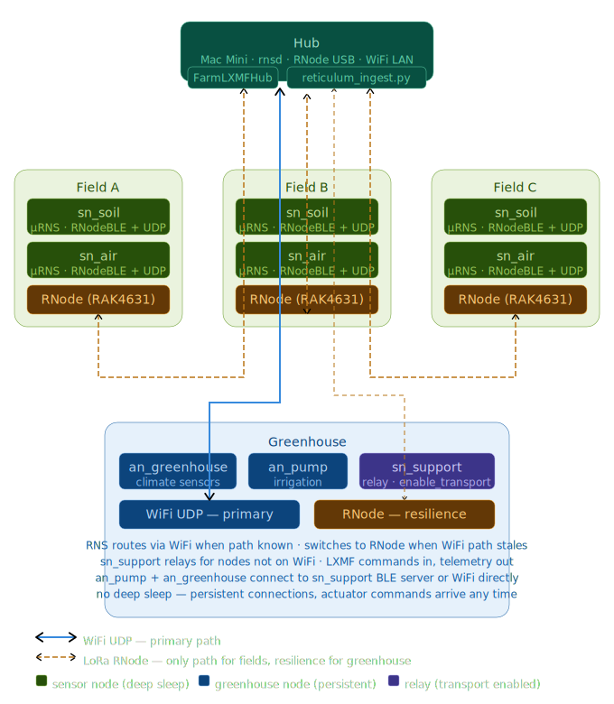

# AgroNomi Fleet

A multi-node farm telemetry and control fleet running on [Reticulum](https://reticulum.network/) mesh networking. Multiple ESP32 sensor and actuator nodes communicate over LoRa (RNode), WiFi, and BLE with a central hub, using encrypted LXMF messaging. Sensors deep-sleep between readings, actuators stay awake for instant command response — all coordinated through a self-organising mesh that requires no internet connection.

Sensor nodes measure temperature, humidity, soil moisture, and battery voltage — then send readings over LoRa or WiFi to a hub that logs everything to a database. Actuator nodes stay awake to receive commands like turning pumps on/off or opening greenhouse vents.

## Attributions

This project builds on three open-source projects:

- **[µReticulum](https://github.com/X5don/uP-reticulum)** by [varna9000](https://github.com/varna9000) — the MicroPython RNS stack that runs on every ESP32 node. The `urns/` library in each node's firmware is a direct copy from this project. We added custom BLE interfaces (`RNodeBLEInterface` for RAK4631 RNode pairing, `BLEClientInterface` for gateway bridging) that are not in upstream µReticulum. Licensed under MIT.
- **[Reticulum](https://github.com/markqvist/Reticulum)** by [markqvist](https://github.com/markqvist) — the full Python RNS implementation that runs on the hub (Mac Mini). The `reticulum_ingest.py` hub script uses RNS and LXMF directly. Licensed under MIT.
- **[MicroPython](https://micropython.org/)** — the Python runtime on ESP32 microcontrollers. Licensed under the MIT License.
- **[RNode Firmware](https://github.com/markqvist/RNode_Firmware)** by [markqvist](https://github.com/markqvist) — the firmware running on the RAK4631 RNode that bridges BLE to LoRa. We use it unmodified — no custom firmware changes. Licensed under MIT.

The `esp32c6/repo/` directory contains the upstream µReticulum repository for reference and firmware builds. It is not a git submodule — we copy the `urns/` and `lib/` directories from it into each node's firmware when flashing.

## What it does

- **Sensor nodes** wake up every 5 minutes, read their sensors, send telemetry over the mesh, listen for commands for 5 seconds, then go back to sleep. Battery life is measured in months.
- **Actuator nodes** stay awake permanently, sending status updates every minute and responding to commands in real time.
- **The hub** (Mac Mini) collects all telemetry into SQLite, discovers new nodes automatically, and can send commands to any actuator.

All communication uses LXMF (encrypted messaging over Reticulum mesh). No JSON, no HTTP, no MQTT — just native Reticulum packets over LoRa and WiFi.

## Nodes

| Node | What it measures / controls | Power |
|------|-----|------|
| **SN-AIR** | Air temperature, humidity, battery voltage | Deep sleep (5 min) |
| **SN-SOIL** | Soil moisture, soil temperature, battery voltage | Deep sleep (5 min) |
| **GW-SUPPORT** | Battery voltage only (gateway support node) | Deep sleep (5 min) |
| **AN-PUMP** | Pump relay, battery voltage | Always on |
| **AN-GREENHOUSE** | Vent relay, shade PWM (0–100%), fan relay, battery voltage | Always on |

## How data flows



**Sensor nodes** wake up, announce themselves on `farm.gateway_commands`, discover the hub, send telemetry via LXMF fields (`dev_id`, `type`, `fw`, `bat`, `temp`, `hum`, `if`), listen for commands for 5 seconds, then deep sleep.

**Actuator nodes** stay awake permanently — they announce every 5 min, send telemetry every 60 sec, and receive commands instantly via LXMF. Every command gets an ACK: `{ack: true, cmd_id: 42, cmd: "pump_on", status: "ok"}`.

## Network topology



Nodes connect via **BLE to RNode** (LoRa) as primary transport, with **WiFi UDP** as secondary for indoor/greenhouse deployments. The hub runs all interfaces simultaneously.

## Telemetry data

Every node sends a flat set of LXMF fields. Common fields:

| Field | Meaning | Example |
|-------|---------|---------|
| `dev_id` | Node name | `SN-AIR-01` |
| `type` | Device type | `air_node` |
| `fw` | Firmware version | `2.0.0-mr` |
| `bat` | Battery voltage | `2.60` |
| `if` | Interface used | `rnode ble` |

Node-specific fields:

| Node | Extra fields |
|------|-------------|
| SN-AIR | `temp`, `hum`, `air_temp_valid`, `air_humidity_valid` |
| SN-SOIL | `soil_moist`, `soil_temp`, `soil_temp_valid` |
| AN-PUMP | `pump_on` (true/false) |
| AN-GREENHOUSE | `vent_open`, `shade_pct`, `fan_on` |

## Commands

Commands are sent from the hub to actuator nodes as LXMF fields:

| Command | Node | What it does |
|---------|------|---------------|
| `pump_on` | AN-PUMP | Turn pump on |
| `pump_off` | AN-PUMP | Turn pump off |
| `vent_open` | AN-GREENHOUSE | Open vent |
| `vent_close` | AN-GREENHOUSE | Close vent |
| `fan_on` | AN-GREENHOUSE | Turn fan on |
| `fan_off` | AN-GREENHOUSE | Turn fan off |
| `shade_pct` | AN-GREENHOUSE | Set shade 0–100% (with `value` field) |

Actuators send an ACK back:

| Field | Example |
|-------|---------|
| `ack` | `true` |
| `cmd_id` | `42` |
| `cmd` | `pump_on` |
| `status` | `ok` or `error` |
| `error` | *(only on error)* `unknown_command: reboot` |

## Hub setup

The hub runs `reticulum_ingest.py` on the Mac Mini. It needs:

1. **RNS installed** — `pip install rns`
2. **RNode connected** via USB — configured with `rnodeconf`
3. **RNS config** — `~/.reticulum/config` with two enabled interfaces:
   - `TCPServerInterface` on `listen_ip = 0.0.0.0`, `listen_port = 4243` — accepts inbound connections from nodes (LAN), and from any Tailscale peer.
   - `RNodeInterface` for the USB-attached RNode (LoRa, 868 MHz / SF11).

   `enable_transport = True` at the top so the hub can route Reticulum packets between its interfaces (needed so remote Tailscale peers can reach the LoRa/TCP nodes through this Mac).

   The `UDPInterface` entry is left in the config file but `enabled = no` — see [Network topology](#network-hub--node-connectivity) for why.

When a node announces, the hub automatically:
- Discovers the node and records its identity
- Pre-registers the node's `lxmf.delivery` destination hash
- Logs the node to SQLite (`sensor_nodes`, `hardware_devices` tables)

When telemetry arrives, the hub:
- Parses the LXMF fields
- Writes each reading to `sensor_readings` as individual rows (`reading_type`, `value`, `unit`)

## Network: hub ↔ node connectivity

The hub and every node share two physical transports — **WiFi** (over TCP) and **LoRa** (over RNode radios). UDP is intentionally not used.

| Channel | Used for | Why |
|---|---|---|
| **TCP / WiFi** | OTA firmware push, real-time commands, telemetry when WiFi is reachable | Reliable, supports the full 16 KB Resource MTU per part, no broadcast traffic on the LAN |
| **LoRa via RNode** | Long-range telemetry, low-power deep-sleep mode, fallback when WiFi is unavailable | Survives without an IP network, range of kilometres |
| ~~UDP broadcast~~ | (disabled) | ESP32 lwIP can't buffer multi-part Resources reliably under broadcast — multi-KB transfers fail with packet loss. TCP solves this cleanly. |

### Address resolution — no hardcoded IPs

The node's `config.py` points its `TCPClientInterface` at `Urbans-Mac-mini.local`, not at `192.168.178.93`. The Mac advertises this name via Bonjour (built into macOS, always on); ESP32 lwIP includes an mDNS resolver and resolves `*.local` names transparently via `socket.getaddrinfo()`. If the router hands the Mac a different IP after a reboot or lease change, **nothing on the node needs to change** — the next reconnect attempt resolves the new IP from mDNS.

This is also why you do not need a DHCP reservation in the router. The Bonjour name is the stable identifier.

If you change the Mac's name, get the canonical one with `scutil --get LocalHostName` and update `target_host` in each node's `config.py` accordingly. (Mixing Bonjour names across machines is fine — each node can point at a different hub.)

### Remote access via Tailscale (optional)

The fleet works end-to-end without Tailscale — that's just for reaching the ESP32s from outside your LAN (e.g. your laptop while travelling, or another Mac in a different building). The pattern is **subnet routing through the hub**: the Mac becomes a Tailscale subnet router that bridges Tailscale traffic into the local 192.168.178.0/24 LAN, so Tailscale clients can hit the ESP32s as if they were on the same network. The ESP32 itself never joins Tailscale (MicroPython has no first-party Tailscale client).

```
Your laptop on Tailscale          urbans-mac-mini             ESP32 fleet
─────────────────────             ────────────────             ───────────
[Tailscale client]                [Tailscale + Bonjour]        [192.168.178.x]
  100.64.x.x ───── encrypted tunnel ────► 100.77.106.18
                                          ║
                                          ▼
                                          enable_transport=True
                                          ║
                                          ▼
                                          192.168.178.93 ─ LAN ► 192.168.178.128
                                                                 (mDNS-resolved
                                                                  via TCP:4243)
```

**What the user has to set up** (one-time on the Mac):

1. **Advertise the LAN subnet** to Tailscale:
   ```bash
   tailscale set --advertise-routes=192.168.178.0/24
   ```

2. **Enable IPv4 forwarding** so the Mac actually routes between Tailscale and LAN:
   ```bash
   sudo sysctl -w net.inet.ip.forwarding=1
   sudo sysctl -w net.inet6.ip6.forwarding=1

   # Persist across reboots:
   echo 'net.inet.ip.forwarding=1' | sudo tee -a /etc/sysctl.conf
   echo 'net.inet6.ip6.forwarding=1' | sudo tee -a /etc/sysctl.conf
   ```

3. **Approve the route** in the Tailscale admin console (this is a one-click security gate that can't be set from CLI):
   - Go to https://login.tailscale.com/admin/machines
   - Click your Mac (`urbans-mac-mini`) → *Edit route settings*
   - Toggle `192.168.178.0/24` on, Save

Verify with `tailscale status --json` on the Mac — you should see `192.168.178.0/24` in the `PrimaryRoutes` field of the self entry.

**What the user does NOT have to set up:**

- No Tailscale client on the ESP32s — they reach the Mac over the local LAN as before.
- No DHCP reservation in the router — mDNS handles IP changes.
- No firewall hole-punching — Tailscale handles NAT traversal.
- No port forwarding on the FRITZ!Box.
- Nothing in `~/.reticulum/config` references Tailscale by name; `listen_ip = 0.0.0.0` catches inbound connections from every interface (LAN, Tailscale `utun4`, loopback).

### When you'd add more interfaces

If you later add a second hub (e.g. a Raspberry Pi field gateway), give it its own `TCPServerInterface` and a Bonjour name, then add a `TCPClientInterface` in each node's `config.py` pointing at `pi-gateway.local:4243` (or whatever you name it). Nodes can have multiple `TCPClientInterface` entries — Reticulum picks the best path automatically. The same mDNS principle applies: as long as the gateway broadcasts its name on the LAN, nodes find it without IPs.

## Node setup

### First-time BLE pairing

Each ESP32 node connects to the RNode over BLE. Before a node can operate on battery power, it needs to be paired once with the RNode so both devices save their bond keys.

**You only do this once per device.** After pairing, the bond is saved to flash and the node will automatically reconnect to the same RNode on every boot.

1. Connect the **RNode** to your Mac via USB
2. Connect the **ESP32-C6** to your Mac via USB
3. Edit the serial ports at the top of `pair_rnode.py` to match your devices:
   ```python
   RNODE_PORT = "/dev/cu.usbmodem23401"   # your RNode
   C6_PORT = "/dev/cu.usbmodem23201"       # your ESP32-C6
   ```
4. Run the pairing script:
   ```bash
   python3 pair_rnode.py
   ```
5. The script will:
   - Put the RNode into pairing mode and read its 6-digit PIN
   - Write the PIN to `ble_pin.txt` on the ESP32-C6
   - Force a fresh pairing session on the C6
   - Reboot the C6 and start `import main`
   - Show interleaved logs from both devices
6. When you see `[RNode BLE] Device is already bonded` and the node connects, pairing is done. Press Ctrl+C to exit.

After this, the ESP32 can run on battery — it will find and connect to the RNode automatically every time it wakes from sleep.

### Flashing

Each ESP32 node needs three things on its filesystem:

1. **MicroPython firmware** (v1.22+) — flashed once with `esptool`
2. **The `urns/` library** — the µReticulum stack, copied from `esp32c6/repo/firmware/urns/`
3. **The node's firmware** — `main.py`, `config.py`, `sensors.py`, `boot.py`, `secrets.py` from the node's `firmware/` folder

**Step 1: Flash MicroPython** (first time only)
```bash
esptool.py --chip esp32c6 erase_flash
esptool.py --chip esp32c6 write_flash -z 0 micropython-esp32c6-1.22.bin
```

**Step 2: Upload µReticulum library**
```bash
mpremote cp -r esp32c6/repo/firmware/urns/ :urns/
mpremote cp -r esp32c6/repo/firmware/lib/ :lib/
```

**Step 3: Upload node firmware**
```bash
mpremote cp sn_air/firmware/main.py :main.py
mpremote cp sn_air/firmware/config.py :config.py
mpremote cp sn_air/firmware/sensors.py :sensors.py
mpremote cp sn_air/firmware/boot.py :boot.py
mpremote cp sn_air/firmware/secrets.py :secrets.py   # edit this file first!
```

**Step 4: Run**
```python
import main
```

Or reboot — `boot.py` runs automatically and launches `main.py`.

> **Updating:** After the initial flash, you only need to repeat steps 2–3 when code changes. MicroPython itself only needs flashing once. If `urns/` hasn't changed, just update the node-specific files (step 3).

### Configuration

Edit `config.py` on each node:

```python
NODE_NAME = "SN-AIR-01"       # Must be unique per node
DEVICE_TYPE = "air_node"       # air_node, soil_node, pump_node, gh_actuator
WIFI_SSID = ""                 # Loaded from secrets.py — leave blank here
WIFI_PASS = ""                 # Loaded from secrets.py — leave blank here
ENABLE_DEEPSLEEP = True         # True for sensors, False for actuators
SLEEP_INTERVAL_SEC = 300        # 5 minutes
```

**WiFi credentials** are stored in `secrets.py` (not tracked by git). Each node's firmware directory has a template:

```python
# secrets.py — fill in your WiFi credentials, this file is gitignored
WIFI_SSID = "YourWiFi"
WIFI_PASS = "YourPassword"
```

If `secrets.py` is missing, the node runs in BLE-only mode (no WiFi). This means:
- A fresh checkout won't accidentally connect to your WiFi
- BLE-only deployments don't need the file at all
- You create `secrets.py` locally per device and never commit it

Interface config in the `CONFIG` dict:

```python
"interfaces": [
    {
        "type": "RNodeBLEInterface",   # BLE → LoRa via RAK4631 (long range)
        "name": "RNode BLE",
        "frequency": 868000000,        # 868 MHz (EU) or 915 MHz (US)
        "spreadingfactor": 11,         # Must match hub RNode
        "codingrate": 5,
        "txpower": 17,
        "enabled": True,
    },
    {
        "type": "TCPClientInterface",  # Reliable WiFi link to the hub
        "name": "Field node to AgroNomi TCP",
        "target_host": "Urbans-Mac-mini.local",  # mDNS — no hardcoded IP
        "target_port": 4243,
        "enabled": True,
    },
    {
        "type": "UDPInterface",        # left for reference; disabled — see Network section
        "name": "WiFi UDP",
        "listen_port": 4242,
        "forward_port": 4242,
        "enabled": False,
    },
]
```

`target_host` is your hub's Bonjour name (find it with `scutil --get LocalHostName` on the Mac). The node uses mDNS to resolve it at connect time, so the Mac's IP can change without breaking anything.

### Adding a new sensor type

1. Copy the `esp32c6/firmware/` template folder to a new directory (e.g. `sn_water/`)
2. Write sensor drivers in `sensors.py` — must expose `read_all(config)` returning a dict with at least `"battery_v"`
3. Add your sensor fields to `_build_telemetry_fields()` in `main.py`
4. Set `NODE_NAME`, `DEVICE_TYPE`, and interface config in `config.py`
5. Flash to ESP32 following the steps above (the `urns/` and `lib/` libraries are the same for all nodes, only the node-specific files change)

## How hub discovery works

This is the key mechanism that makes telemetry delivery reliable.

When a node boots, it doesn't know the hub's LXMF address. It only knows to listen for announces on `farm.gateway_commands`. When the hub announces itself:

1. **Node side** — The node's `_on_announce` callback receives the hub's identity, computes the hub's `lxmf.delivery` destination hash, and seeds `Identity.remember()` so `LXMRouter.send_message()` can find it later.

2. **Hub side** — The `NodeDiscoveryHandler` receives the node's announce, computes the node's `lxmf.delivery` hash, and seeds `RNS.Identity.remember()` so the hub can decrypt incoming telemetry.

Without this seeding, `Identity.recall()` fails silently because RNS stores public keys under **destination hashes**, not identity hashes — and a `farm.gateway_commands` hash is cryptographically different from an `lxmf.delivery` hash.

## Hardware

| Component | Role |
|-----------|------|
| ESP32-C6 Super Mini | Node MCU (MicroPython) |
| RAK4631 RNode | LoRa radio + BLE bridge (connected to Mac Mini USB) — runs [RNode Firmware](https://github.com/markqvist/RNode_Firmware) (unmodified) |
| DHT22 | Air temperature + humidity (SN-AIR) |
| Capacitive soil probe | Soil moisture (SN-SOIL) |
| DS18B20 | Soil temperature (SN-SOIL) |
| Relay module | Pump/vent/fan control (actuators) |
| PWM output | Shade position 0–100% (AN-GREENHOUSE) |

## Troubleshooting

| Symptom | Cause | Fix |
|---------|-------|-----|
| Hub logs "Pre-registered" but no telemetry | Node not discovering hub | Check node sees hub announce in serial output |
| Node logs "Hub discovered" but no "Telemetry routed" | `send_message` returning None | Node needs `_hub_lxmf_hash` + `Identity.remember()` — check `_on_announce` |
| Hub logs "Cannot send LXMF: unknown identity" | Public key not seeded under correct hash | Both sides must seed `lxmf.delivery` hashes in `_on_announce` / `received_announce` |
| BLE pairing fails | RNode not in pairing mode | Run `rnodeconf --bluetooth-pair` or set `serial_port` in config for auto-pairing |
| Node won't wake from sleep | `ENABLE_DEEPSLEEP = False` in config | Set to `True` for production deployment |

## Firmware updates (OTA)

Firmware updates push over the Reticulum mesh from the hub — no USB cable needed after the initial flash. The protocol handles ESP32-C6 heap constraints by chunking large files at the wire level.

### How it works

1. You edit firmware files in this repo
2. On the hub, run `tools/firmware_push.py <device> --version X.Y.Z` — it inserts a `firmware_pushes` row for that device type and version
3. Next time the target node sends an `fw_check` packet (every boot), the hub dispatches the push
4. The hub opens an RNS Link to the node, sends `update_begin`, then streams each file as one or more `RNS.Resource` transfers
5. The node's `updater.py` accumulates chunks per filename, verifies the whole-file SHA-256 once the final chunk arrives, and writes the assembled file to `/update/<filename>`
6. After all files are acked, the hub sends `update_commit`
7. The node writes `/update/.reboot_needed` and calls `machine.reset()`
8. On next boot, `boot.py → updater.check_pending_update()` moves files from `/update/` over `/` and reboots once more — `main.py` then loads the new firmware

Atomicity: each file's chunks are SHA-256-verified at the receiver before `_transfer_state["received"]` is incremented. The reboot marker is only written if every expected file passed verification. Power loss before `update_commit` leaves no marker, and the staged `/update/` directory is wiped on the next `update_begin`.

### Chunking protocol

Each `update_file` Resource carries one chunk of one file plus enough metadata for the receiver to reassemble:

| Field | Type | Purpose |
|---|---|---|
| `cmd` | str | Always `"update_file"` |
| `filename` | str | Same for every chunk of one file |
| `data` | bytes | This chunk's bytes (≤ `CHUNK_SIZE` on the sender) |
| `sha256` | str (hex) | SHA-256 of the *whole* file — verified only on the last chunk |
| `chunk_index` | int | 0-based chunk position |
| `total_chunks` | int | Total chunks for this file (1 = whole file in one Resource) |
| `index` / `total` | int | File position in the multi-file push (existing fields, unchanged) |

The receiver opens the file in `"wb"` mode on `chunk_index == 0` (truncating any stale copy), in `"ab"` mode for every subsequent chunk, and feeds each chunk's bytes into a running `uhashlib.sha256`. On `chunk_index == total_chunks - 1`, it finalizes the hash and compares to the sender-provided whole-file `sha256`. Mismatch → the staged file is deleted and `_transfer_state["failed"]` increments. Match → `_transfer_state["received"]` increments. `update_commit` checks `received == file_count` before writing the reboot marker.

A sender that omits `chunk_index` and `total_chunks` (or sets `total_chunks=1`) gets the original single-shot behavior — the protocol is fully backward-compatible with one-chunk-per-file pushes.

### Why chunking — the heap constraint that drives `CHUNK_SIZE`

The urns `Resource.assemble()` path allocates two full-size byte buffers simultaneously (concatenated `stream` + decrypted `plaintext`), so a 15 KB Resource needs ~30 KB of contiguous heap. On ESP32-C6 with BLE + WiFi + crypto state already loaded, the largest available contiguous chunk by the time firmware push runs is ~6 KB. Anything larger fails with `MemoryError: allocating XXXXX bytes`, which propagates out of `Transport.inbound` before the local try/except in `assemble()` can catch it — the link is then poisoned and the rest of the transfer hangs.

`CHUNK_SIZE = 4096` in `documents/reticulum_ingest.py` keeps every Resource's plaintext under that ceiling with comfortable headroom. If you ever profile a different ESP32 variant with more heap, raise this knob. If you target a constrained-er board, lower it — the receiver doesn't care about the value, only that chunks arrive in order.

### Hub-side: queueing a push

```bash
# Queue a push for one device type (creates a row in firmware_pushes)
python3 tools/firmware_push.py sn_air --version 2.6.0-mr

# Without --version, version is read from m_reticulum/<device>/firmware/config.py
python3 tools/firmware_push.py an_pump

# Stage but don't trigger reboot (apply on next manual restart)
python3 tools/firmware_push.py an_greenhouse --no-reboot
```

The hub's `reticulum_ingest.py` picks up the queued row on the node's next `fw_check`. If you queue a push for a version the node already runs, the dispatcher marks the row `'sent'` without dispatching — no re-push loop.

### Node-side: receiver

Each node has `updater.py` (identical copy across `m_reticulum/*/firmware/`, synchronized from `esp32c6/firmware/updater.py`). It handles three control commands:

- `update_begin` — initializes `_transfer_state`, clears `/update/` of stale files
- `update_file` — receives a chunk (see protocol table above)
- `update_commit` — verifies all-files-received count, writes `.reboot_needed`, calls `machine.reset()`

`boot.py → updater.check_pending_update()` runs on every boot (including deep-sleep wakeups) and applies pending updates before `main.py` loads.

### Files involved

| File | OTA-pushed | Staged to | Purpose |
|------|--------------|-----------|---------|
| `main.py` | ✓ (chunked if > 4 KB) | `/update/main.py` | Node runtime |
| `config.py` | ✓ | `/update/config.py` | Node configuration |
| `sensors.py` | ✓ | `/update/sensors.py` | Sensor drivers |
| `boot.py` | ✓ | `/update/boot.py` | Boot script (handles staging) |
| `updater.py` | ✓ (chunked if > 4 KB) | `/update/updater.py` | OTA receiver module |
| `secrets.py` | ✗ never | — | WiFi credentials (stays on device) |
| `identity` | ✗ never | — | Node identity keypair (stays on device) |

### USB is for first-deployment only

A node needs one USB flash on the bench before it goes to the field — to put MicroPython, the `urns/` library, and the initial firmware on the device. After that the node never needs to be touched physically: every firmware change reaches it over the mesh, and failures are self-recovering.

```bash
# One-time, bench only, before deployment:
mpremote cp m_reticulum/<device>/firmware/boot.py      :boot.py
mpremote cp m_reticulum/<device>/firmware/updater.py   :updater.py
mpremote cp m_reticulum/<device>/firmware/main.py      :main.py
mpremote cp m_reticulum/<device>/firmware/config.py    :config.py
mpremote cp m_reticulum/<device>/firmware/sensors.py   :sensors.py
mpremote cp m_reticulum/<device>/firmware/secrets.py   :secrets.py
```

### Will it work over LoRa-only (no WiFi)?

Yes — the protocol is transport-agnostic. If the node has only `RNodeBLEInterface` online, RNS routes the Link over LoRa via the RAK4631. Chunked Resources work the same way; they're just slower. At 868 MHz / SF11 / BW125 the link is ~1.3 kbps, so a 4 KB chunk is ~25 s on the air. A full 5-file push with `main.py` + `updater.py` (each ~15 KB → 4 chunks) is around 10-15 minutes. `_suspend_ble_interface` only fires if WiFi connects, so pure-LoRa boots leave LoRa up automatically.

### What's handled in code (not just hand-waved)

Every layer of failure has a recovery path on the node itself — no USB intervention in the field.

**Transient failures during transfer (handled at hub):**

- **Chunk-level Resource FAILED.** Hub-side `MAX_FILE_ATTEMPTS = 3` retries each chunk on the existing link. The receiver discards a half-received chunk on the next `chunk_index=0`.
- **Whole-push failure** (link drop, repeated chunk failure, receiver cancel). Hub-side `_run_fw_push` re-queues the push (`status='pending'`, `retries++`) instead of marking it `'failed'`. The next `fw_check` from the node re-dispatches automatically. After `MAX_PUSH_RETRIES = 5` re-queues for the same row, the hub gives up so a genuinely broken build doesn't loop forever.
- **Same-version pending rows.** The dispatcher auto-marks them `'sent'` on the first `fw_check` from a node already running that version. No re-push storms.

**Catastrophic failures (handled at node):**

- **Power loss mid-transfer.** The reboot marker is only written if every file's whole-file SHA-256 matched. Without it, `boot.py` does nothing and `main.py` runs the old firmware. The half-staged files in `/update/` are wiped on the next `update_begin`.
- **Power loss mid-apply** (after `update_commit`, during the rename loop). Backups of every overwritten file live at `/backup_<name>.py`; the `.unconfirmed` marker is written *before* any new file lands. On next boot the rollback path restores backups.
- **Newly applied firmware crashes on import** (syntax error, missing import, top-level exception). `boot.py` wraps `import main` in `try/except`; any failure triggers `machine.reset()`. The `.unconfirmed` boot counter increments. After `_MAX_UNCONFIRMED_BOOTS = 3` resets without `confirm_running_firmware()` being called, `boot.py` restores `/backup_<name>.py` over the running files and resets again. Old firmware is back.
- **Newly applied firmware imports OK but crashes before reaching steady state** (init code throws, hub never discovered, network never up). Same path — `asyncio.run(main())` propagates the exception out, `boot.py`'s try/except catches it, reset, counter increments, eventually rollback.
- **Newly applied firmware runs but degrades after some time.** Once `main.py` has reached the listen loop and called `updater.confirm_running_firmware()`, the `.unconfirmed` marker is gone and backups are deleted. Subsequent crashes still reset (because `boot.py` wraps `import main` in try/except) but don't roll back — we've already accepted this firmware as good. If you actually want to revert further back, queue an OTA push of the prior version.

**Confirmation contract:** `updater.confirm_running_firmware()` is the explicit signal that the new firmware is good enough to keep. It's called from every node's `main.py` immediately before entering its main listen loop. If you fork a node's `main.py`, don't skip this call — without it, every new firmware push will roll back after three boots.

**Files involved in the rollback machinery:**

| Marker / file | Set by | Cleared by | Purpose |
|---|---|---|---|
| `/update/.reboot_needed` | hub via `update_commit` packet | `updater.check_pending_update` once apply starts | "Apply staged files on next boot" |
| `/update/.unconfirmed` | `updater.check_pending_update` before any rename | `updater.confirm_running_firmware()` from `main.py` | "We've applied a new build, hasn't proven itself yet" |
| `/update/.boot_count` | `boot.py` on every unconfirmed boot | `updater.confirm_running_firmware()` or `boot.py` after rollback | Counts how many resets the unconfirmed build survived |
| `/backup_<name>.py` | `updater._backup_current_files` before move | `updater.confirm_running_firmware()` or `boot.py` after rollback | Atomic rename target for the file being overwritten |

### Performance notes worth knowing

- **Per-Resource proof timing.** RNS hardcodes the sender-side `AWAITING_PROOF` retry to 3 × `(rtt × 3 + 10s grace) ≈ 46 s`. If a chunk's prove path on the node ever exceeds that (pure-Python bz2 decompression of a compressed chunk can be tens of seconds on RISC-V), the hub gives up on that chunk and the app-layer retry kicks in. This is why `RNS.Resource` is built with `auto_compress=False` — the receiver never has to bz2-decompress, so prove stays in single-digit milliseconds. If you ever build a native `bz2_fast_*.mpy` for your specific board, you can flip this back on to shrink wire size.
- **Per-device serialization.** The dispatcher processes one push at a time per device type. Queueing pushes for both an SN-AIR and an SN-SOIL works fine — they serialize naturally as each node's `fw_check` arrives.
- **TCP connection-reset warnings after commit.** Expected and cosmetic. The node calls `machine.reset()` immediately after the commit packet, which closes its half of the TCP socket. The hub's `TCPInterface` logs the reset; the next reconnect cycle restores the link.

## File structure

```
m_reticulum/
├── sn_air/           # Air temp/humidity sensor
│   └── firmware/
│       ├── main.py       # Sensor firmware
│       ├── config.py      # Node configuration
│       ├── secrets.py      # WiFi credentials (gitignored)
│       ├── sensors.py     # DHT22 + battery drivers
│       └── boot.py        # Boot script with update support
├── sn_soil/          # Soil moisture/temp sensor
│   └── firmware/...
├── sn_support/       # Support/gateway node (battery only)
│   └── firmware/...
├── an_pump/          # Pump actuator
│   └── firmware/...
├── an_greenhouse/    # Greenhouse actuator (vent/shade/fan)
│   └── firmware/...
├── esp32c6/          # Template — copy this to create new nodes
│   └── firmware/
│       ├── main.py
│       ├── config.py
│       ├── secrets.py     # WiFi credentials (gitignored)
│       ├── sensors.py     # Battery ADC driver
│       ├── updater.py     # OTA update receiver
│       ├── boot.py        # Boot script with update swap
│       └── urns/          # µReticulum library (shared)
├── esp32c6/repo/     # Upstream µReticulum repository (reference)
├── tools/
│   ├── deploy.sh         # USB deploy script (initial flash)
│   └── firmware_push.py  # Over-the-mesh firmware push
├── secrets/              # Per-device WiFi credentials (gitignored, local only)
│   ├── sn_air/secrets.py
│   ├── sn_soil/secrets.py
│   ├── sn_support/secrets.py
│   ├── an_pump/secrets.py
│   └── an_greenhouse/secrets.py
pair_rnode.py             # BLE pairing script
documents/
├── README.md              # This file
└── reticulum_ingest.py   # Hub ingestion engine (Mac Mini)
```

## License

- **AgroNomi application code** (node firmware, hub script): MIT License
- **µReticulum** (`urns/`, `lib/`): MIT License — Copyright (c) varna9000
- **Reticulum**: MIT License — Copyright (c) markqvist
- **RNode Firmware**: MIT License — Copyright (c) markqvist
- **MicroPython**: MIT License — Copyright (c) Damien P. George